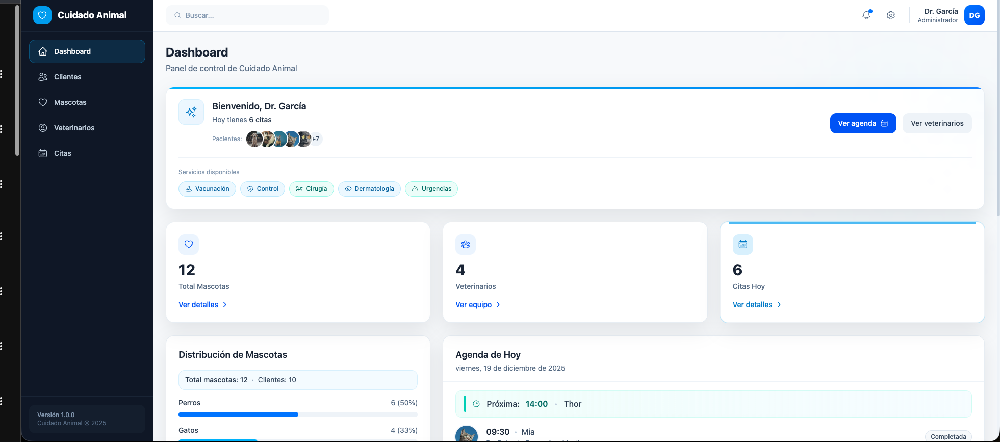
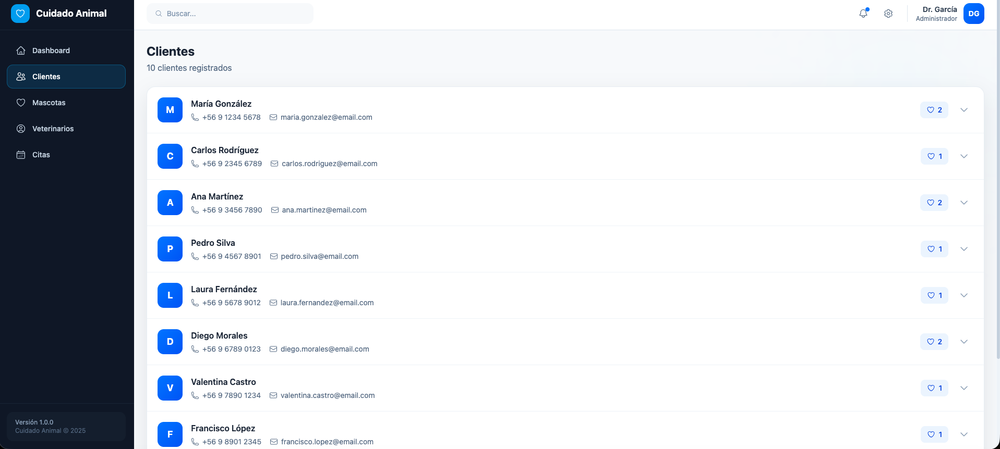
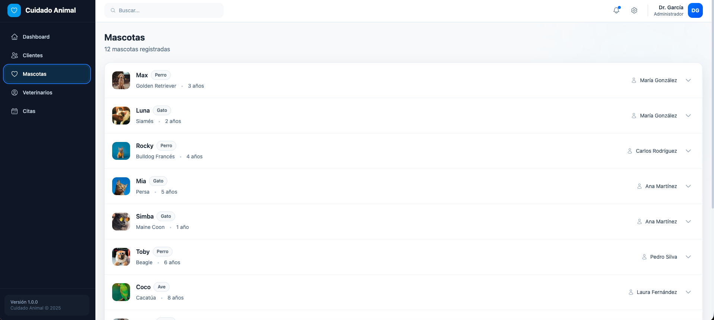
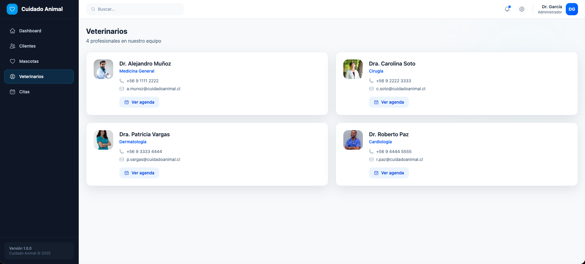
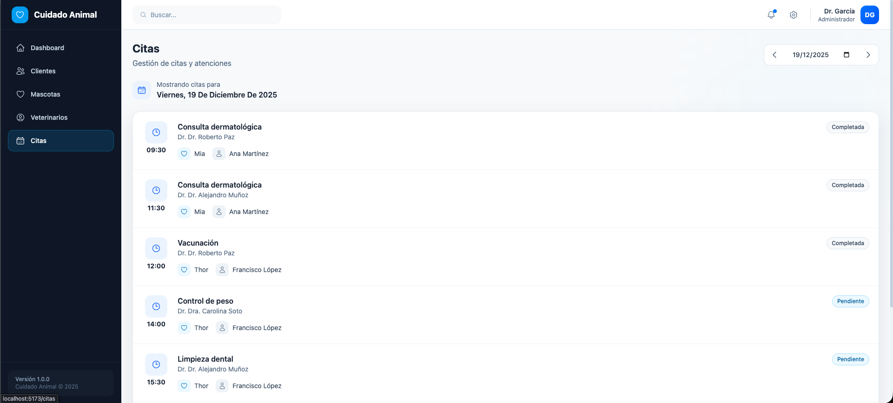

<div align="center">

# Cuidado Animal

### Sistema de Gestión Veterinaria

Dashboard administrativo para clínicas veterinarias con gestión de clientes, mascotas, veterinarios y citas médicas.

<br />



<br />


<br />


</div>

---

## Características Principales

- **Dashboard interactivo** con KPIs, estadísticas y agenda del día
- **Gestión de clientes** con expansión de detalles y mascotas asociadas
- **Catálogo de mascotas** con historial médico expandible
- **Directorio de veterinarios** con agenda individual por profesional
- **Sistema de citas** con filtrado por fecha y estados (pendiente, en progreso, completada)
- **Backend mock integrado** — REST API + GraphQL + MSW, sin servidores externos
- **Cobertura de testing** completa con Vitest (unit) y Cypress (E2E)
- **Diseño responsivo** con Tailwind CSS y componentes reutilizables

---

## Stack Tecnológico

| Categoría | Tecnología |
|-----------|------------|
| **Framework** | React 19 + Vite 7 |
| **Estilos** | Tailwind CSS 4 |
| **Estado Global** | Redux Toolkit + React Redux |
| **Routing** | React Router DOM 7 |
| **Testing Unit** | Vitest + Testing Library + jsdom |
| **Testing E2E** | Cypress 15 + Code Coverage |
| **Mock API** | MSW 2 (Mock Service Worker) |
| **API Layer** | REST (fetch) + GraphQL (graphql-request) |
| **Linting** | ESLint 9 |
| **Build** | Vite + SWC |

---

## Requisitos

- **Node.js** >= 20.x (recomendado: v24.x o última LTS)
- **npm** >= 10.x

---

## Instalación y Ejecución

```bash
# 1. Clonar el repositorio
git clone https://github.com/tu-usuario/cuidado-animal.git
cd cuidado-animal

# 2. Instalar dependencias
npm install

# 3. Ejecutar en modo desarrollo
npm run dev
```

La aplicación estará disponible en **http://localhost:5173**

> **Nota:** El backend mock (MSW) se activa automáticamente en desarrollo. No necesitas levantar servidores adicionales.

---

## Scripts Disponibles

| Script | Descripción |
|--------|-------------|
| `npm run dev` | Inicia servidor de desarrollo (Vite + MSW) |
| `npm run build` | Genera build de producción |
| `npm run preview` | Previsualiza el build de producción |
| `npm run lint` | Ejecuta ESLint en el proyecto |
| `npm run test` | Ejecuta tests unitarios (Vitest) |
| `npm run test:watch` | Tests en modo watch |
| `npm run test:coverage` | Tests con reporte de cobertura |
| `npm run test:ui` | Abre Vitest UI |
| `npm run cy:open` | Abre Cypress en modo interactivo |
| `npm run cy:run` | Ejecuta Cypress en modo headless |
| `npm run e2e` | Levanta servidor + ejecuta Cypress |
| `npm run e2e:open` | Levanta servidor + abre Cypress UI |
| `npm run dev:rest` | Servidor REST standalone (puerto 3001) |
| `npm run dev:gql` | Servidor GraphQL standalone (puerto 4000) |
| `npm run dev:all` | Vite + REST + GraphQL concurrentemente |

---

## Estructura del Proyecto

```
cuidado-animal/
├── cypress/                    # Tests E2E
│   ├── e2e/                    # Specs de Cypress
│   │   ├── appointments.cy.js
│   │   ├── clientes.cy.js
│   │   ├── dashboard.cy.js
│   │   ├── mascotas.cy.js
│   │   ├── navigation.cy.js
│   │   └── veterinarios.cy.js
│   ├── fixtures/               # Datos de prueba E2E
│   ├── screenshots/            # Capturas automáticas
│   └── support/                # Configuración Cypress
├── mock-server/                # Servidores REST y GraphQL standalone
├── public/
│   ├── images/                 # Assets estáticos (fotos mascotas/vets)
│   └── mockServiceWorker.js    # Service Worker de MSW
├── src/
│   ├── api/                    # Clientes REST y GraphQL
│   ├── app/                    # AppRouter y MainLayout
│   ├── assets/                 # Assets internos
│   ├── components/             # Componentes UI reutilizables
│   │   ├── Badge.jsx
│   │   ├── Card.jsx
│   │   ├── EmptyState.jsx
│   │   ├── ErrorState.jsx
│   │   ├── Loading.jsx
│   │   ├── PageHeader.jsx
│   │   ├── Sidebar.jsx
│   │   ├── StatCard.jsx
│   │   └── Topbar.jsx
│   ├── features/               # Módulos por funcionalidad
│   │   ├── appointments/       # Gestión de citas
│   │   ├── clients/            # Gestión de clientes
│   │   ├── dashboard/          # Dashboard principal
│   │   ├── pets/               # Gestión de mascotas
│   │   └── vets/               # Gestión de veterinarios
│   ├── hooks/                  # Custom hooks (useClients, usePets, etc.)
│   ├── mocks/                  # MSW handlers y datos mock
│   ├── store/                  # Redux store y slices
│   ├── App.jsx
│   ├── main.jsx
│   └── index.css
├── tests/
│   ├── msw/                    # Configuración MSW para tests
│   ├── setup/                  # Setup de Vitest
│   ├── test-utils/             # Helpers de testing
│   └── unit/                   # Tests unitarios
│       ├── api/
│       ├── app/
│       ├── components/
│       ├── features/
│       ├── hooks/
│       └── store/
├── cypress.config.js
├── eslint.config.js
├── vite.config.js
├── vitest.config.js
└── package.json
```

---

## Datos y Backend Mock

Este proyecto utiliza **tres capas de mocking** que funcionan sin necesidad de servidores externos:

### MSW (Mock Service Worker)

El approach principal. MSW intercepta las peticiones HTTP a nivel de Service Worker:

- Se activa automáticamente en desarrollo (`npm run dev`)
- Handlers definidos en `src/mocks/handlers.js`
- Datos mock en `src/mocks/data.js`
- Soporta tanto REST (`/api/*`) como GraphQL (`/graphql`)

### REST API Mock

Endpoints disponibles:

| Método | Endpoint | Descripción |
|--------|----------|-------------|
| GET | `/api/clients` | Lista de clientes |
| GET | `/api/pets` | Lista de mascotas |
| GET | `/api/vets` | Lista de veterinarios |
| GET | `/api/appointments?date=YYYY-MM-DD` | Citas por fecha |

### GraphQL Mock

Endpoint: `/graphql`

Queries disponibles:
- `pets` — Lista de mascotas con historial médico
- `clients` — Lista de clientes con mascotas asociadas
- `vets` — Lista de veterinarios
- `appointments(date, vetId)` — Citas filtradas

---

## Testing

### Tests Unitarios (Vitest)

```bash
# Ejecutar tests
npm run test

# Con cobertura
npm run test:coverage

# Modo watch
npm run test:watch

# UI interactiva
npm run test:ui
```

**Resultados de cobertura:**

```
---------------------------|---------|----------|---------|---------|
File                       | % Stmts | % Branch | % Funcs | % Lines |
---------------------------|---------|----------|---------|---------|
All files                  |   85.02 |    83.27 |   85.40 |   85.07 |
---------------------------|---------|----------|---------|---------|
 src/api                   |  100.00 |    93.75 |  100.00 |  100.00 |
 src/app                   |   80.00 |   100.00 |   75.00 |   80.00 |
 src/components            |  100.00 |    90.90 |  100.00 |  100.00 |
 src/features/appointments |   71.42 |    78.57 |   63.63 |   71.42 |
 src/features/clients      |   71.42 |    72.00 |   80.00 |   70.37 |
 src/features/dashboard    |   75.38 |    83.14 |   80.95 |   72.41 |
 src/features/pets         |   83.33 |    85.71 |  100.00 |   83.33 |
 src/features/vets         |   80.88 |    70.00 |   69.56 |   84.12 |
 src/hooks                 |  100.00 |   100.00 |  100.00 |  100.00 |
 src/store                 |  100.00 |   100.00 |  100.00 |  100.00 |
 src/store/slices          |   90.47 |   100.00 |   90.90 |   90.32 |
---------------------------|---------|----------|---------|---------|

Test Files  13 passed (13)
     Tests  179 passed (179)
```

### Tests E2E (Cypress)

```bash
# Modo interactivo (requiere servidor corriendo)
npm run e2e:open

# Modo headless (levanta servidor automáticamente)
npm run e2e

# Solo Cypress (si ya tienes servidor en :5173)
npm run cy:run
```

**Resultados E2E:**

```
====================================================================================================

  (Run Finished)

       Spec                                              Tests  Passing  Failing  Pending  Skipped
  ┌────────────────────────────────────────────────────────────────────────────────────────────────┐
  │ ✔  appointments.cy.js                       00:02       10       10        -        -        - │
  ├────────────────────────────────────────────────────────────────────────────────────────────────┤
  │ ✔  clientes.cy.js                           00:02       10       10        -        -        - │
  ├────────────────────────────────────────────────────────────────────────────────────────────────┤
  │ ✔  dashboard.cy.js                          00:01        7        7        -        -        - │
  ├────────────────────────────────────────────────────────────────────────────────────────────────┤
  │ ✔  mascotas.cy.js                           00:01        9        9        -        -        - │
  ├────────────────────────────────────────────────────────────────────────────────────────────────┤
  │ ✔  navigation.cy.js                         00:02        8        8        -        -        - │
  ├────────────────────────────────────────────────────────────────────────────────────────────────┤
  │ ✔  veterinarios.cy.js                       00:02       13       13        -        -        - │
  └────────────────────────────────────────────────────────────────────────────────────────────────┘
    ✔  All specs passed!                        00:11       57       57        -        -        -

```

**Cobertura E2E:**

| Métrica | Porcentaje |
|---------|------------|
| Statements | 78.07% |
| Branches | 65.67% |
| Functions | 74.68% |
| Lines | 76.95% |

---

## Capturas de Pantalla

### Dashboard


### Clientes


### Mascotas


### Veterinarios


### Citas


-->

---

## Convenciones y Buenas Prácticas

- **Arquitectura por features** — Cada módulo contiene su página, componentes y lógica relacionada
- **Custom hooks** — Abstracción de lógica de datos (`useClients`, `usePets`, `useVets`, `useAppointments`)
- **Redux Toolkit** — Slices con `createAsyncThunk` para operaciones asíncronas
- **Componentes UI** — Biblioteca interna de componentes reutilizables (`Card`, `Badge`, `Loading`, etc.)
- **Testing** — Tests colocados junto a la estructura de `src/` en `tests/unit/`
- **ESLint** — Configuración estricta con plugins para React Hooks y Refresh

---

## Roadmap

- [ ] Implementar CRUD completo para clientes
- [ ] Agregar formulario de nueva cita
- [ ] Sistema de notificaciones
- [ ] Modo oscuro
- [ ] Exportación de reportes (PDF/Excel)
- [ ] Autenticación y roles de usuario

---

## Contribución

Las contribuciones son bienvenidas. Por favor:

1. Haz fork del repositorio
2. Crea una rama para tu feature (`git checkout -b feature/nueva-funcionalidad`)
3. Realiza tus cambios con commits descriptivos
4. Asegúrate de que los tests pasen (`npm run test && npm run e2e`)
5. Abre un Pull Request

---

## 🚀 Deploy en GitHub Pages

### URL de Producción

**🔗 [https://rodrigosanchezdev.github.io/cuidado-animal-testing-jest-cypress/](https://rodrigosanchezdev.github.io/cuidado-animal-testing-jest-cypress/)**

### Configuración Automática

El proyecto incluye un workflow de GitHub Actions que despliega automáticamente cada push a `main`.

**Para habilitar GitHub Pages:**

1. Ve a tu repositorio en GitHub
2. **Settings** → **Pages**
3. En **Source**, selecciona **GitHub Actions**
4. El primer deploy se ejecutará automáticamente

### Funcionamiento del Routing (SPA)

- **Local (`npm run dev`):** Funciona con `base: '/'`
- **Producción (Pages):** Usa `base: '/cuidado-animal-testing-jest-cypress/'`
- **Refresh en rutas profundas:** El archivo `404.html` redirige al `index.html` preservando la ruta, permitiendo que React Router maneje `/clientes`, `/mascotas`, etc.

### Verificación

```bash
# Local funciona igual
npm run dev

# Build genera /dist con base correcto
npm run build

# Preview local del build de producción
npm run preview
```

---

## Licencia

Este proyecto está bajo la licencia **MIT**. Consulta el archivo [LICENSE](LICENSE) para más detalles.

---

<div align="center">

## Autor

<br />

**Rodrigo Sánchez** — Desarrollador Full Stack

<br />

[](https://sanchezdev.com/)
[](mailto:Rodrigo@sanchezdev.com)
[](https://www.linkedin.com/in/sanchezdev)

<br />

[](https://www.sanchezdev.com/documents/CV-Espanol.html)
[](https://www.sanchezdev.com/agenda)

<br />

---

<sub>Desarrollado con React + Vite + Tailwind CSS</sub>

</div>
